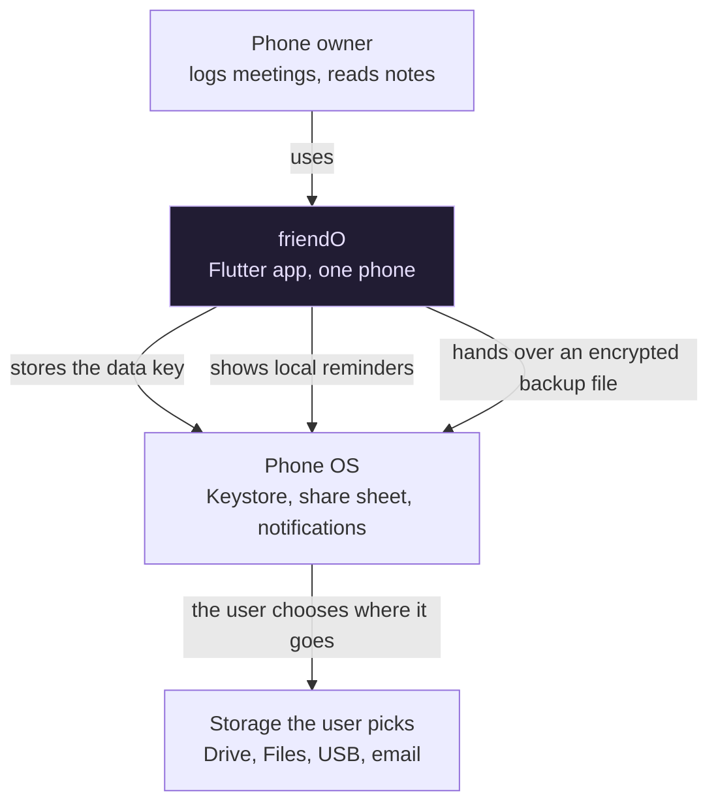
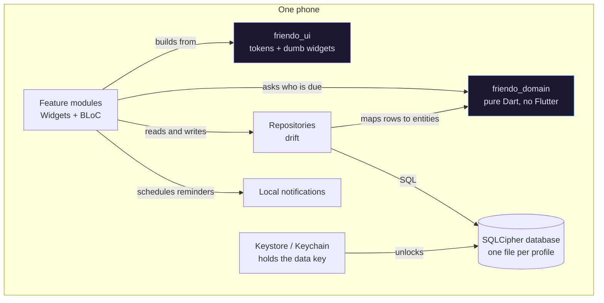
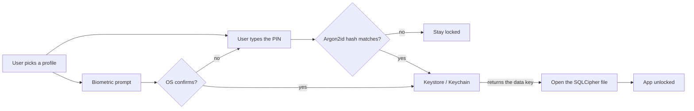

# friendO Architecture

friendO is a private notepad and reminder for friendships. It tracks how often you want to see
each person. It then tells you who to see next.

The app runs on one phone. It has no server, no account, and no network access.

[CONTEXT.md](../CONTEXT.md) holds the glossary. Use the words it chooses. This file and the
decision records follow it.

## Contents

- [What the app does](#what-the-app-does)
- [Constraints](#constraints)
- [System context](#system-context)
- [Containers](#containers)
- [The domain core](#the-domain-core)
- [Data and keys](#data-and-keys)
- [Module map](#module-map)
- [Decision records](#decision-records)

## What the app does

People meet on cadences. You may want to see family every week. You may want to see old friends
every month. You may want to see colleagues every quarter.

friendO stores that wanted cadence for each person. It also stores the date you last met them.
From those two facts the app works out who is due next.

The home screen shows a dial. Each friend is a bead that orbits the centre. A bead travels
from 12:00 all the way round and back to 12:00. One full lap equals one cadence. Close friends sit
on a small ring, so their lap is short. Distant friends sit on a large ring, so their lap is long.

When you log a meeting, that friend's bead jumps back to 12:00 and starts again.

Each friend also holds notes: conversation topics, what is new in their life, and free text. You
read those notes before you meet the person.

## Constraints

| Constraint | Where it is decided |
|---|---|
| Flutter and BLoC | [ADR-0002](adr/0002-flutter-and-bloc.md) |
| No network, no server, no sharing | [ADR-0003](adr/0003-offline-only-no-internet-permission.md) |
| Data is encrypted on the device | [ADR-0006](adr/0006-keystore-dek-with-pin-gate.md) |
| The threat is a stolen phone, not a rooted phone | [ADR-0006](adr/0006-keystore-dek-with-pin-gate.md) |
| Two people may share one phone | [ADR-0007](adr/0007-database-per-profile.md) |
| About 100 friends maximum | Product limit. The app tracks people you meet on purpose. |

The 100 friend cap matters for design. The database stays small. Every list fits in memory. No
query needs an index for speed. Do not add caching or pagination for this size.

## System context



The app never talks to any storage service. It writes an encrypted file and gives it to the OS.
The user then picks the destination. See [ADR-0010](adr/0010-encrypted-logical-backup.md).

## Containers



## The domain core

The app stores a cadence and a list of meetings per friend. Everything on the dial comes from
those.

```
  STORED                          DERIVED
  ------                          -------
  cadence  : Duration     ---->   lastMet = max(dates of this friend's meetings)
  meetings : [Instant]    ---->   dueAt   = lastMet + cadence
                          ---->   phase   = (now - lastMet) / cadence
       plus injected now  ---->   overdue = phase > 1
                          ---->   ring    = bucket(cadence)
                          ---->   order   = sort all friends by priority
```

No timer keeps the dial correct. No angle is saved. You log a meeting, `lastMet` moves to the
newest meeting date, and the next read gives the right dial. The dial is also correct after the phone sleeps for a month.

The domain sorts every friend into one list:

1. Overdue friends first, oldest `dueAt` first. This answers "who became overdue first".
2. Then on-track friends, highest `phase` first.

The first item in that list is the friend the banner names. See
[ADR-0009](adr/0009-derived-phase-and-overdue-queue.md).

The domain knows nothing about rings, pixels, or angles. The UI turns the list into bead
positions. See [ADR-0014](adr/0014-dial-layout-and-bead-packing.md).

## Data and keys



The PIN never becomes the encryption key. The PIN only opens the gate. The real key is a random
number that the phone hardware protects. A stolen phone gives no access to the file. A lost PIN
does not destroy the data. See [ADR-0006](adr/0006-keystore-dek-with-pin-gate.md).

Each profile gets its own file and its own key. Profile B cannot read profile A, even when B is
unlocked. See [ADR-0007](adr/0007-database-per-profile.md).

The backup file uses a different key. That key comes from a passphrase the user remembers. The
Keystore key dies with the phone, so a backup cannot depend on it. See
[ADR-0010](adr/0010-encrypted-logical-backup.md).

## Module map

```
friendO/
|
+-- packages/
|   +-- friendo_domain/          Pure Dart. No Flutter. No file access. No clock.
|   |   +-- cadence.dart         Cadence duration and ring bucketing
|   |   +-- phase.dart           phase, dueAt, overdue, priority order, counts
|   |   +-- friend.dart          Friend, Meeting, Note, Fact, Affinity, Milestone
|   |
|   +-- friendo_ui/              Flutter. No BLoC. No repository. No domain.
|   |   +-- tokens/              Soft theme extension. Colours, shadows, radii.
|   |   +-- widgets/             SoftCard, SoftWell, SoftButton, Pill, Glow, AvatarRing
|   |
|   +-- friendo_ui_book/         Widgetbook workspace. Sees friendo_ui and nothing else.
|
+-- lib/
|   +-- core/                    Shared services used by many features
|   |   +-- crypto/              Data key, Argon2id, AES-GCM
|   |   +-- db/                  drift tables, SQLCipher setup, migrations
|   |   +-- media/               Avatar images and audio recaps. Stored as blobs.
|   |   +-- security/            App lock, screen privacy, auto-lock
|   |   +-- time/                Clock. Every "now" comes from here.
|   |
|   +-- features/                One folder per user-facing area
|   |   +-- dial/                The dial. The main screen.
|   |   +-- friends/             Add, edit, delete people
|   |   +-- journal/             Meetings, notes, topics, what is new
|   |   +-- auth/                Profiles, PIN, session
|   |   +-- backup/              Export and import
|   |   +-- settings/            Reminder switch and app options
|   |
|   +-- app/                     Wiring only: routes, dependency setup, Soft.dark()
|
+-- docs/                        This file and the decision records
```

Each feature folder holds its own `bloc/`, `view/`, and repository. A feature may use `core/`,
`friendo_domain` and `friendo_ui`. A feature must not import another feature.

Two rules hold by compilation, not by review. `friendo_domain` never imports Flutter.
`friendo_ui` never imports a BLoC, a repository, or the domain. `friendo_ui` therefore holds
treatments such as `SoftCard`, never concepts such as `FriendBead`. See
[ADR-0018](adr/0018-ui-package-and-widgetbook.md).

## Decision records

Every choice above has a record in [docs/adr/](adr/README.md). Read the record before you change
a choice. The record lists what was rejected and why.
