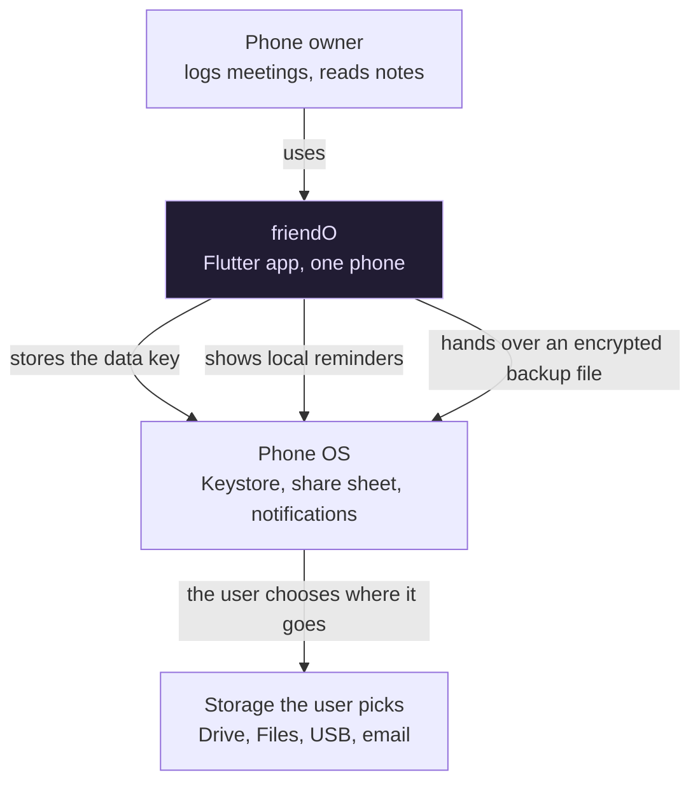
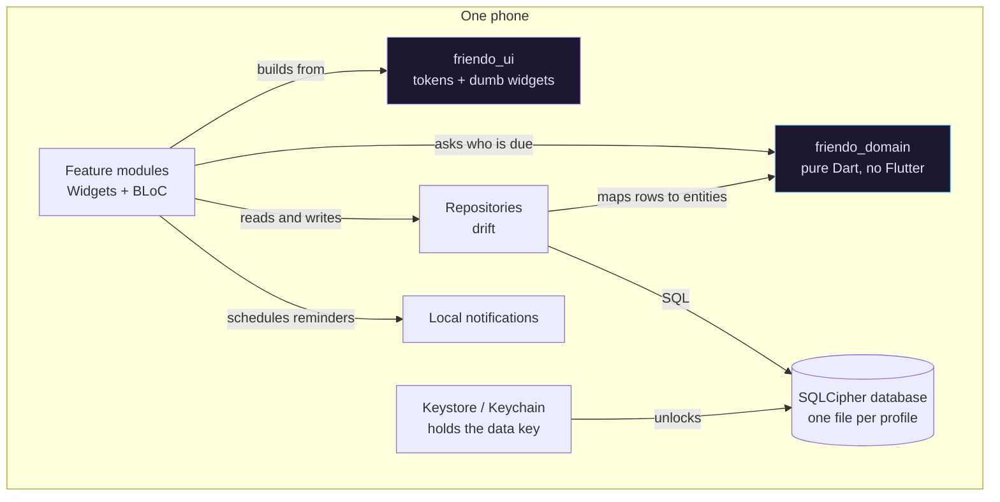
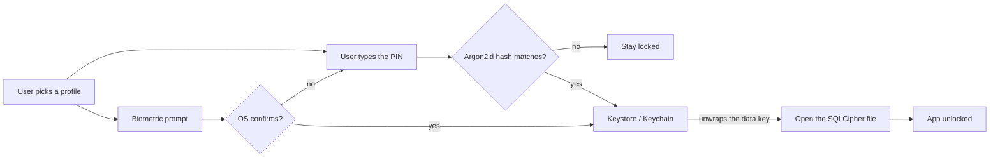

# friendO Architecture

friendO is a private notepad and reminder for friendships. It tracks how often you want to see
each person. It then tells you who to see next.

The app runs on one phone. It has no server, no account, and no network access.

[CONTEXT.md](../CONTEXT.md) holds the glossary. Use the words it chooses. This file and the
decision records follow it.

## Contents

- [friendO Architecture](#friendo-architecture)
  - [Contents](#contents)
  - [What the app does](#what-the-app-does)
  - [Constraints](#constraints)
  - [System context](#system-context)
  - [Containers](#containers)
  - [The domain core](#the-domain-core)
  - [Data and keys](#data-and-keys)
  - [Module map](#module-map)
  - [Decision records](#decision-records)

## What the app does

People meet on cadences. You may want to see family every week. You may want to see old friends
every month. You may want to see colleagues every quarter.

friendO stores that wanted cadence for each person. It also stores the date you last met them.
From those two facts the app works out who is due next.

The home screen shows a dial. Each friend is a bead that orbits the centre. A bead travels
from 12:00 all the way round and back to 12:00. One full lap equals one cadence. Close friends sit
on a small orbit, so their lap is short. Distant friends sit on a large orbit, so their lap is long.

When you log a meeting, that friend's bead jumps back to 12:00 and starts again.

Each friend also holds notes: conversation topics, what is new in their life, and free text. You
read those notes before you meet the person.

## Constraints

| Constraint | Where it is decided |
|---|---|
| Flutter and BLoC | [ADR-0002](adr/0002-flutter-and-bloc.md) |
| No network, no server, no sharing | [ADR-0003](adr/0003-offline-only-no-internet-permission.md) |
| The OS backs up nothing, so the Backup is the only route to a new phone | [ADR-0020](adr/0020-no-os-level-backup.md) |
| Data is encrypted on the device | [ADR-0006](adr/0006-keystore-dek-with-pin-gate.md) |
| The threat is a stolen phone, not a rooted phone | [ADR-0006](adr/0006-keystore-dek-with-pin-gate.md) |
| Two people may share one phone | [ADR-0007](adr/0007-database-per-profile.md) |
| About 100 friends maximum | Product limit. The app tracks people you meet on purpose. |

The 100 friend cap matters for design. The database stays small. Every list fits in memory. No
query needs an index for speed. Do not add caching or pagination for this size.

## System context



The app never talks to any storage service. It writes an encrypted file and gives it to the OS.
The user then picks the destination. See [ADR-0010](adr/0010-encrypted-logical-backup.md).

## Containers



## The domain core

The app stores a cadence and a list of meetings per friend. Everything on the dial comes from
those.

```
  STORED                          DERIVED
  ------                          -------
  cadence  : whole days   ----->  lastMet  = max(dates of this friend's meetings)
  meetings : [civil date] ----->  dueAt    = lastMet + cadence, in calendar days
             + optional time,     phase    = (now - midnight of lastMet) / cadence
               ignored here       overdue  = today > dueAt
                                  standing = freshlyReset | inOrbit | nearing | overdue
  plus injected now       ----->  orbit    = bucket(cadence)
                                  order    = overdue by dueAt, then on track by phase
```

A meeting happens on a **civil date**: a calendar day with no time and no zone. It may also carry a
time of day, which the app shows and the dial ignores. `now` is an instant and always arrives as an
argument. See [ADR-0021](adr/0021-civil-date-time-model.md).

Overdue compares two civil dates, not two phases. A friend is not overdue on their own due date.

No timer keeps the dial correct. No angle is saved. You log a meeting, `lastMet` moves to the
newest meeting date, and the next read gives the right dial. The dial is also correct after the phone sleeps for a month.

The domain sorts every friend into one list:

1. Overdue friends first, oldest `dueAt` first. This answers "who became overdue first".
2. Then on-track friends, highest `phase` first.

The first item in that list is the friend the banner names. The two groups are held apart rather
than flattened into one comparator, so "overdue first" holds by construction. See
[ADR-0009](adr/0009-derived-phase-and-overdue-queue.md) and
[ADR-0028](adr/0028-priority-order-as-two-groups.md).

The same ordered list gives the three counts on the home screen. Every friend has exactly one
standing, so the counts add up. See [ADR-0029](adr/0029-name-the-dial-counts.md).

The domain knows nothing about orbits, pixels, or angles. The UI turns the list into bead
positions. See [ADR-0014](adr/0014-dial-layout-and-bead-packing.md).

## Data and keys



The PIN never becomes the encryption key. The PIN only opens the gate. The real key is a random
number, and the phone hardware holds a second, non-exportable key that wraps it. The data key is
stored wrapped and is unwrapped into memory to open the file. A stolen phone gives no access,
because the wrapping key cannot leave the hardware. A lost PIN loses the Profile, and v1 has no way
back. See [ADR-0006](adr/0006-keystore-dek-with-pin-gate.md),
[ADR-0024](adr/0024-keystore-holds-a-wrapping-key.md) and
[ADR-0031](adr/0031-a-forgotten-pin-loses-the-profile.md).

The profile list lives in one plaintext `profiles.json` beside the databases. It has to be readable
before any profile is unlocked, so no key can cover it. That is why
[ADR-0020](adr/0020-no-os-level-backup.md) turns the OS backup off.

Each profile gets its own file and its own key. Profile B cannot read profile A, even when B is
unlocked. See [ADR-0007](adr/0007-database-per-profile.md).

The backup file uses a different key. That key comes from a passphrase the user remembers. The
Keystore key dies with the phone, so a backup cannot depend on it. See
[ADR-0010](adr/0010-encrypted-logical-backup.md).

The backup is a framed file, not one JSON document: an encrypted manifest, then encrypted raw
attachment bytes, one 1 MiB frame at a time. Base64 inside JSON would inflate the file by a third
and hold the whole of it in memory at once. See
[ADR-0026](adr/0026-attachments-as-blobs-and-a-framed-backup.md).

## Module map

```
friendO/
|
+-- packages/
|   +-- friendo_domain/          Pure Dart. No Flutter. No file access. No clock.
|   |   +-- civil_date.dart      A calendar day. No time, no zone.
|   |   +-- cadence.dart         Cadence in whole days, and orbit bucketing
|   |   +-- phase.dart           phase, dueAt, overdue
|   |   +-- standing.dart        The four standings and the dial counts
|   |   +-- priority_order.dart  Placing, and the ranking held as two groups
|   |   +-- friend.dart          Friend, Meeting, Note, Fact, Affinity, Milestone.
|   |                            The aggregate. It refuses to lose its last meeting.
|   |
|   +-- friendo_ui/              Flutter. No BLoC. No repository. No domain.
|   |   +-- text/                A colour and an initial, from any text.
|   |   +-- tokens/              Soft theme extension. Colours, shadows, radii.
|   |   +-- widgets/             SoftCard, SoftWell, SoftButton, Pill, Glow, AvatarHalo
|   |
|   +-- friendo_ui_book/         Widgetbook workspace. Sees friendo_ui and nothing else.
|
+-- lib/
|   +-- core/                    Shared services used by many features
|   |   +-- crypto/              Key wrapping, Argon2id, framed AES-GCM
|   |   +-- db/                  SQLCipher setup, migrations, and the one owner of
|   |   |                        the open connection. One file per table in
|   |   |                        tables/.
|   |   +-- friends/             FriendRepository. The whole aggregate, and the
|   |   |                        only place that reads or writes these tables.
|   |   +-- reminders/           Watches the repository and the reminder settings.
|   |   |                        Cancels and schedules so the two agree. The only
|   |   |                        caller of flutter_local_notifications.
|   |   +-- ids/                 One fresh id for a row this app writes
|   |   +-- media/               Avatar images and audio recaps, as BLOB columns
|   |   +-- profiles/            profiles.json, the PIN hash, and the wrapped
|   |   |                        data key by name. The list is read before any
|   |   |                        Profile is unlocked, so it belongs to no
|   |   |                        feature.
|   |   +-- security/            App lock, screen privacy, auto-lock
|   |   +-- settings/            The Profile's own options. The auto-lock seconds,
|   |   |                        the reminder switch and hour, and the screenshot
|   |   |                        allowance. core/security/ and core/reminders/
|   |   |                        read them, and neither may import a feature.
|   |   +-- text/                The fold that search matches, and nothing else
|   |   +-- time/                Clock. Every "now" comes from here.
|   |
|   +-- features/                One folder per user-facing area
|   |   +-- dial/                The dial. The main screen.
|   |   +-- friends/             Add, edit and delete people, and the Friend
|   |   |                        Notepad: Meetings, Topics, Updates, Notes,
|   |   |                        Facts and Milestones
|   |   +-- auth/                Profiles, PIN, session
|   |   +-- backup/              Export and import
|   |   +-- settings/            Reminder switch and app options
|   |
|   +-- app/                     Wiring only: dependency setup, Soft.dark()
|       +-- navigation/          One GoRouter. It owns the boot screens, the three
|                                sections and everything pushed over them. A locked
|                                Profile is one redirect, checked for every route,
|                                so no screen has to remember it. See ADR-0037.
|
+-- docs/                        This file and the decision records
```

Each feature folder holds its own `bloc/` and `view/`. A feature may use `core/`, `friendo_domain`
and `friendo_ui`. **A feature must not import another feature.**

**One feature holds both Friend screens, and there is no `features/journal/`.** Add a Friend and
the Friend Notepad share one Cadence picker, and that widget reads `Cadence`, `Orbit`, `dueDateOf`
and `Standing`. ADR-0018 forbids `friendo_ui` from importing the domain, and a feature may not
import another feature, so two feature folders would leave the picker no legal home. Merging them
leaves the rule stronger, because the import that would have broken it cannot be written. See
[docs/spec/add-notepad-and-settings.md](spec/add-notepad-and-settings.md).

**Repositories are not in features.** Look in `core/friends/`, not in `features/friends/`. Three
features read meetings and two write them, so a repository per feature would mean three row
mappings and no owner for the rule that a friend always has at least one meeting. One aggregate,
one repository, whole loads and whole saves. A read that only draws takes a read model instead. See
[ADR-0022](adr/0022-one-repository-per-aggregate.md).

**One object owns the database connection.** [ADR-0011](adr/0011-app-lock-and-screen-privacy.md)
closes the handle on lock, which kills every drift stream in the app. `core/db/` holds the
connection and publishes open or locked. Repositories ask it for a connection and never hold one.
Blocs clear on lock rather than throwing. See
[ADR-0025](adr/0025-one-owner-for-the-database-connection.md).

A rule that spans more than one row lives in the domain. Everything else is a plain repository call
from the bloc, exactly as [ADR-0004](adr/0004-pure-domain-core-feature-shell.md) says.

Two rules hold by compilation, not by review. `friendo_domain` never imports Flutter.
`friendo_ui` never imports a BLoC, a repository, or the domain. `friendo_ui` therefore holds
treatments such as `SoftCard`, never concepts such as `FriendBead`. See
[ADR-0018](adr/0018-ui-package-and-widgetbook.md).

The compiler proves that today's code compiles. It cannot prove that the boundary still exists,
because the boundary lives in three `pubspec.yaml` files. `tool/boundaries.sh` watches those files
and runs inside `tool/lint.sh`. `tool/manifest_guard.sh` reads the no-network and no-backup
promises out of the release APK. See [ADR-0023](adr/0023-check-the-guarantees-in-ci.md).

## Decision records

Every choice above has a record in [docs/adr/](adr/README.md). Read the record before you change
a choice. The record lists what was rejected and why.
